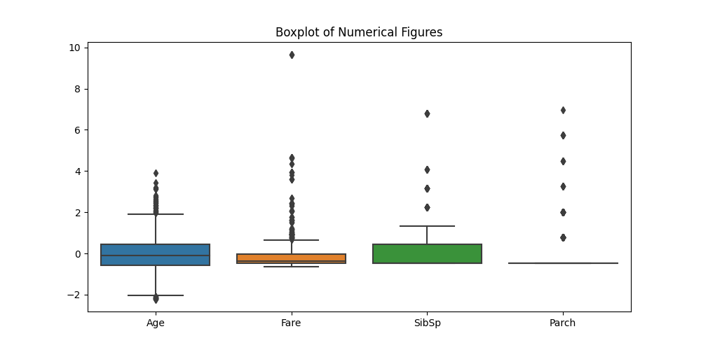

# Titanic Dataset – Data Cleaning & Preprocessing

This project demonstrates how to clean and preprocess real-world data for Machine Learning using the [Titanic Dataset from Kaggle](https://www.kaggle.com/datasets/yasserh/titanic-dataset).

## 📌 Objective

To learn and implement the essential steps of data cleaning and preparation:
- Handling missing values
- Encoding categorical features
- Feature scaling
- Visualizing and removing outliers

## 🛠️ Tools & Libraries

- Python
- Pandas & NumPy
- Seaborn & Matplotlib
- scikit-learn

## 📁 Files Included

- `Titanic-Dataset.csv`: Raw dataset
- `data_cleaning.py`: Full preprocessing script
- `outlier_boxplot.png`: Screenshot of boxplot visualizing outliers
- `README.md`: Project description

## ✅ Steps Performed

1. **Imported** the dataset and inspected structure, data types, and null values
2. **Handled missing values**:
   - Imputed `Age` with median
   - Filled `Embarked` with mode
   - Dropped `Cabin` due to excessive nulls
3. **Converted categorical variables**:
   - Used `pd.get_dummies()` for `Sex` and `Embarked`
   - Removed irrelevant text columns like `Name` and `Ticket`
4. **Normalized numerical features** (`Age`, `Fare`, `SibSp`, `Parch`) using `StandardScaler`
5. **Visualized and removed outliers** using boxplots and IQR method

## 📸 Screenshot

## 📚 Reference

Dataset Source: [Kaggle - Titanic Dataset by Yasser H](https://www.kaggle.com/datasets/yasserh/titanic-dataset)

---

Feel free to fork, clone, or build upon this project!
